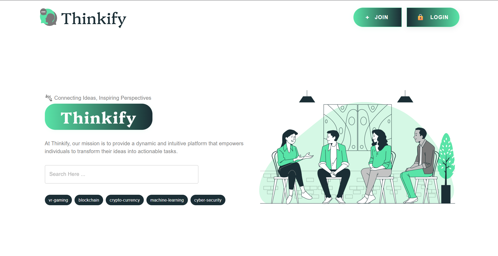

# Thinkify

Welcome to Thinkify! This project is a modern platform for community engagement, idea sharing, and collaborative learning.

---

## 🚀 About This Project

Thinkify is a full-stack web application that enables users to connect, share posts, manage products, and collaborate on tasks. It features role-based access for admins, students, and institutions/teachers.

---

## 👤 Author

**Dev Karan Singh**  
Email: dev1604karan@gmail.com 
GitHub: [DKSingh1604](https://github.com/DKSingh1604)

---

## 🖼️ Preview



---

## 🌐 Live Demo

<!-- Update these links if you deploy your own version -->
- [Frontend Live](https://your-frontend-url.com)
- [API Live](https://your-backend-url.com)

---

## 🛠️ Getting Started

### Prerequisites
- [Node.js](https://nodejs.org/)
- [MongoDB](https://www.mongodb.com/)

### Installation

Clone the repository:
```sh
git clone https://github.com/DKSingh1604/thinkify.git
cd thinkify-main
```

#### Backend Setup
```sh
cd server
npm install
npx nodemon index.js
```

#### Frontend Setup
```sh
cd ../client
npm install
npm run dev
```

---

## ⚙️ Environment Variables

### Frontend (`client/.env`)
```
VITE_SERVER_ENDPOINT = http://localhost:3000/api
VITE_TOKEN_KEY = thinkify
VITE_USER_ROLE = role
VITE_COOKIE_EXPIRES = 1
```

### Backend (`server/.env`)
```
PORT = 3000
DATABASE_URL = mongodb://localhost:27017/
DATABASE_NAME = thinkify
BCRYPT_GEN_SALT_NUMBER = 10
JWT_SECRET_KEY = your_jwt_secret
COOKIE_EXPIRES = 5d
COOKIE_KEY = thinkify
UPLOAD_DIRECTORY = uploads
```

---

## ✨ Features

- User authentication & registration
- Role-based dashboards (Admin, Student, Institution/Teacher)
- Post creation and management
- Product management
- Task management
- Profile and settings
- Responsive UI

---

## 📄 License

This project is open source. You may modify and use it as you wish. Please update this section with your preferred license.

---

## 🙏 Acknowledgements

This project was originally inspired by the open-source community. Special thanks to all contributors.
